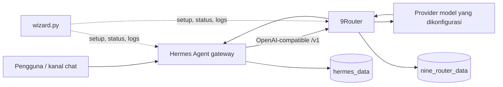

# Arsitektur

Stack ini menggabungkan tiga bagian yang tetap terpisah: Hermes menjalankan
agent dan kanal, 9Router merutekan permintaan model, sedangkan wizard hanya
membantu konfigurasi dan lifecycle Docker Compose.

## Diagram

## Service dan port

| Komponen | Runtime | Akses | Persistensi |
|---|---|---|---|
| 9Router | `decolua/9router:latest` | Host port `NINE_ROUTER_PORT` (default `20128`), internal `20128` | Named volume ke `/app/data` |
| Hermes | `nousresearch/hermes-agent:latest`, `gateway run` | Tidak ada port yang dipublikasikan oleh Compose | Named volume ke `/opt/data` |
| Skill aman | File repo | Read-only di `/opt/data/skills/syadagentic-safe` | Tetap ada di repo; jangan edit dari container |
| Wizard | Python lokal | Tidak membuka port | Mengelola `.env`; tidak menghapus volume |

Hermes memanggil URL internal Compose `http://9router:20128/v1`. URL ini hanya
berlaku pada network project Compose yang sama. Dashboard dan API 9Router
dipublikasikan melalui port host agar provider dapat diatur dan endpoint dipakai
dari luar bila diperlukan.

## Batas keamanan

- 9Router mewajibkan Bearer API key pada endpoint `/v1/*` melalui
  `REQUIRE_API_KEY=true`.
- Hermes menyimpan `NINE_ROUTER_API_KEY` sebagai environment variable. Nilai
  key tidak ditulis ke README, notebook, atau config model Hermes; config hanya
  menyimpan nama variable `model.key_env`.
- Wizard membuat `JWT_SECRET`, `API_KEY_SECRET`, dan `MACHINE_ID_SALT` acak.
  File `.env` lokal berisi secret dan jangan pernah commit atau unggah ke Kaggle.
- Hermes tidak dipublikasikan sebagai port host. Jangan membuka API server
  Hermes ke internet tanpa autentikasi dan reverse proxy yang sesuai.
- Set `AUTH_COOKIE_SECURE=true` saat dashboard 9Router diakses di belakang HTTPS.

## Model dan data

Daftar provider dan model dikonfigurasi di dashboard 9Router. Hermes memilih
model ID yang tersedia dan menggunakan custom provider dengan base URL
`http://9router:20128/v1`. Database 9Router berada di volume `/app/data`; config,
state, dan session Hermes berada di `/opt/data`. `docker compose down` tidak
menghapus volume. `docker compose down -v` menghapusnya dan bersifat destruktif.

Untuk deployment service-per-service di Railway/Koyeb, gunakan private network
platform dan ganti URL Compose `9router` dengan hostname private yang diberikan
platform. Buat volume persisten pada kedua service; nama dan kebijakan volume
bergantung pada platform.